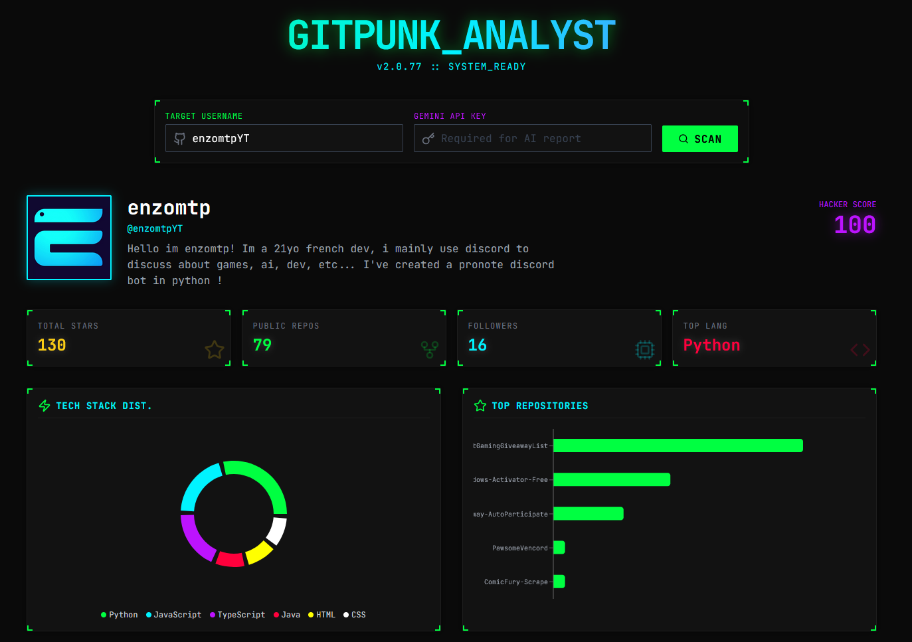

<div align="center">


# GitPunk Analyst

**GitPunk Analyst** is a Cyberpunk-themed GitHub profile analyzer that turns developer stats into a futuristic "Hacker Score". It scans public GitHub profiles, visualizes data with neon-soaked charts, and uses Google's Gemini AI to generate a witty, recruiter-style "Insight Report" based on the user's coding habits.

 ✨ **100% AI-Generated Code**
> **Note:** This entire application—including all logic, UI design, styling, and documentation—was written exclusively by **Google Gemini**, with no manual coding by human developers.

</div>

---

## 🚀 Features

- **Cyberpunk UI:** A fully immersive dark-mode interface with neon accents, glassmorphism, and smooth animations.
- **Deep Profile Scanning:** Fetches and analyzes:
  - Total stars earned.
  - Public repository count.
  - Follower count.
  - Most used programming languages.
  - Top performing repositories.
- **Hacker Score:** Calculates a unique score based on your GitHub influence and activity.
- **AI-Powered Insights:** Uses Gemini to analyze your profile data and generate a detailed "Recruiter Insight" report, highlighting strengths and potential "red flags" with a cyberpunk flair.
- **Visual Data:** Interactive charts (Pie and Bar charts) powered by Recharts.
- **"Bring Your Own Key" (BYOK):** Users enter their own Gemini API key for the AI analysis features, ensuring privacy and control.

## 🛠️ Tech Stack

- **Frontend:** React + TypeScript + Vite
- **Styling:** Tailwind CSS + Custom Cyberpunk Theme
- **AI Integration:** Google GenAI SDK (`@google/genai`)
- **Visualization:** Recharts
- **Icons:** Lucide React

## 🏁 Getting Started

### Prerequisites
- Node.js (v18 or higher)
- npm
- A [Google Gemini API Key](https://aistudio.google.com/app/apikey) (for AI features)

### Installation

1. **Clone the repository:**
   ```bash
   git clone <repository-url>
   cd gitpunk
   ```

2. **Install dependencies:**
   ```bash
   npm install
   ```

3. **Run the development server:**
   ```bash
   npm run dev
   ```
   The app will run on `http://localhost:8083`.

4. **Enter API Key:**
   Enter your Gemini API Key in the "Gemini API Key" input field to unlock the AI analysis features.

## 📖 How to Use

1. **Enter Target:** Type a GitHub username (e.g., `octocat`) into the "Target Username" field.
2. **Scan:** Click the **Scan** button to fetch public profile data.
3. **View Stats:** Explore the dashboard to see the Hacker Score, language distribution, and top repos.
4. **Unlock AI Analysis:**
   - Enter your Gemini API Key.
   - Click **Generate Report** to receive a personalized, AI-generated breakdown of the profile.

## 🤖 "Made with Gemini" Disclaimer

This project serves as a demonstration of the capabilities of **Gemini 2.0 Flash** acting as an autonomous software engineer. Every line of code, from the React components to the CSS styling and API integration logic, was generated by the model in response to high-level user instructions.

---
<div align="center">
  <p>Run and deploy your AI Studio app</p>
  <a href="https://ai.studio/apps/drive/12Ia2lBYiWti7zQH_gLJuIqJUdaTpzOGf">View original concept in AI Studio</a>
</div>